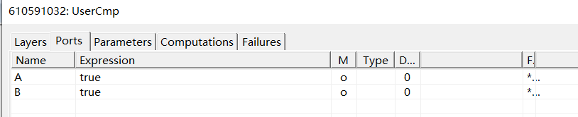

2020.11.04

(前期配置见README.md)
***
## get_port_location()遇到的问题

* **官方解释**

    Based on the location and any rotation and/or mirroring of this
    component, return the location of the named port.

    Parameters:
        name (str): Name of port

    Returns:
        Location (x,y) of the port,
        or `None` if the port  is not enabled or does not exist.

* 我新建了一个resistor的组件，打开properties，按照里面的ports的name：A,B试着代入，发现报错。

    

    ```python
    execute <command name="get-port-location" scope="UserCmp" sequence-id="15"><scope><project name="test_auto_create" /><definition name="Main" /><component id="992453784" /></scope><port name="B" /></command> failed
    resp <commandresponse elapsed="0" sequence-id="15" success="false" timestamp="2020-11-04-02-44-13-5619246" />
    ```

    接下来我会测试一下是不是只有封装的才有port这个参数
